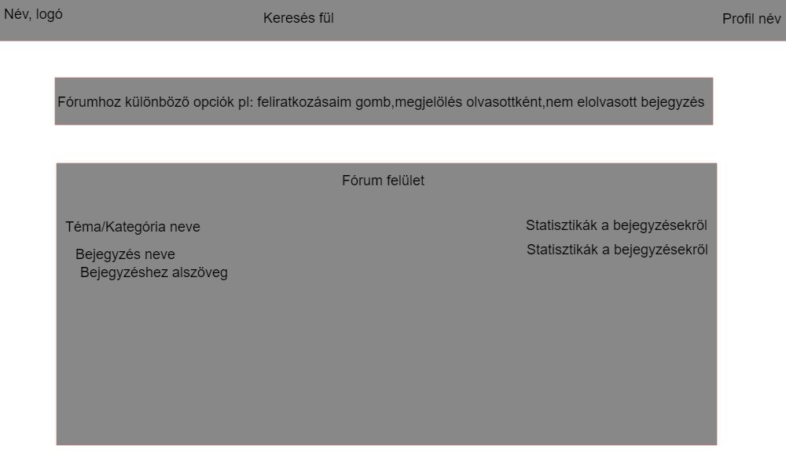
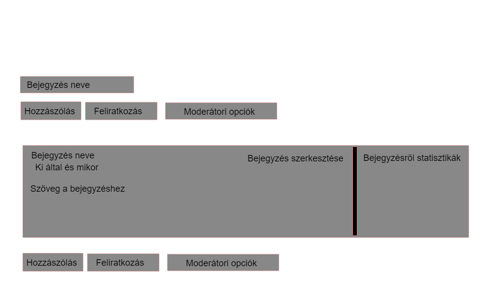

# Funkcionális Specifikáció

## Áttekintés
A weblapunk lényege hogy közösséget formáljon a fórum használata által. A fórummal szeretnénk megtalálni azokat a személyeket akik erre vevők. 
A fórum használata ingyenes viszont regisztrációhoz kötött.
A felhasználók böngészhetnek a témák között, és ha regisztrálnak az oldalra, akkor bejegyzéseket hozhatnak létre, illetve hozzászólhatnak témákhoz, bejegyzésekhez, segíthetnek másoknak, segítséget kérhetnek másoktól, információt oszthatnak meg másokkal, illetve véleményt formálhatnak észszerű keretek között.
A fórumot moderátorok felügyelik, ezzel segitve a felhasználókat, és az adminisztrátorokat.
Bizunk benne, hogy a fórumon egy jó közösség alakul ki, akik összetartanak.

## Jelenlegi helyzet
A jelenlegi helyzetből adódóan megnőtt az internetezők száma, és megnőtt az érdeklődési ráta a fórumok felé. Ezért szeretnénk lehetőséget nyújtani ahhoz, hogy egy könnyen és egyszerűen használható fórum felületen keresztül biztositsunk lehetőséget a közösséghez csatlakozó személyek számára. Az emberek többsége hamar be tud csatlakozni egy ilyen online közösségbe, és reméljük, ez itt is így jön létre, és egy nagyon jó közösség fog kialakulni.

## Jelenlegi üzleti folyamatok modellje

A mai világban, ahol már mindent összeköt az internet; sokkal könnyebben tarthatjuk a kapcsolatot a meglévő ismerősökkel, barátokkal. A közösségformálás egy fontos dolog ezért próbálunk ebben segíteni.
Szeretnénk azt elérni, hogy egy jó közösség alakuljon ki, ezzel segítve egymást. Továbbá segíteni akarjuk azokat a felhasználókat, akik egy közösségen belül többféle embertől várnak visszajelzést, véleményt az általuk interneten sokat keresett dolgokkal kapcsolatban. Reméljük, hogy az egész országban egy kis online közösséget tudunk alkotni, és idővel bővíteni a regisztrált tagok számát.

## Igényelt üzleti folyamatok modellje

Azért, hogy egyszerűbbé tegyük a közösség formálódását, létrehoztunk egy weblapot, ami megfelel a mai kor elvárásainak, és helyt tud állni az online világban. Felhasználóinknak így egyszerűbb lesz bármiről információt megosztani, valamint segíteni másokon vagy segítséget kérni. A weblap felépítésében maximálisan támogatja a regisztrált felhasználók azon csoportját, akik nyitottak mások megismerésére, új információk befogadására, és lehetőséget biztosít saját véleményük megosztására is. Legfontosabb célja és szerepe, hogy biztosítsa a tagok közötti információcserét, illetve információszerzést.

## Használati esetek
**Admin**: Az Admin kezelheti az összes, minden más felhasználó által elérhető funkciót, hogy azok hibamentes működését ellenőrizhesse. Az Admin(ok) feladata a rendszer problémamentes működtetése. Ez egyben azzal jár, hogy az egész rendszerhez van hozzáférésük. Az Admin(ok)-nak hozzá kell tudni férniük a felhasználók listájához, ahol mindent láthatnak és módosíthatnak egy felhasználó profilján. Tudniuk kell a felhasználók jogosultságait, szerepkörét, jelszavát, és felhasználó nevét módosítani. Továbbá képesnek kell lenniük arra, hogy felhasználókat vegyenek fel a rendszerbe, és amennyiben a felhasználó nem tartja be a felhasználási feltételeket, úgy eltávolítsák őket.
**Moderátor**: A Moderátor hasonló az adminhoz viszont kevesebb joggal rendelkezik, segíti az admin munkáját abban, hogy a moderálja a fórumon történő hozzászólásokat, bejegyzéseket. Segít az oldalon megtalálható hibák feltárásában, javításában. A beszélgetésekben, posztokban figyeli a felhasználási irányelvek betartását, és ezeket felfüggesztheti, az admin felülvizsgálatáig.
**Felhasználó**: A Felhasználó bejelentkezés után eléri saját profilját, és azok profiljának publikus részét, akik regisztráltak. Továbbá képes a témákba belépni, és ott bejegyzéseket létrehozni/módosítani, szavazásokat indítani, hozzászólni bejegyzésekhez. A felhasználók (User-ek) hozzáférnek saját profiljukhoz, amin módosítani tudják saját személyes adataikat (Felhasználói név, jelszó, e-mail), és meg tudják jelölni azokat privátnak, vagy publikusnak. Biztonsági okokból jelszavukat bármikor módosíthatják. Keresést tudnak indítani "szűrők" alapján.
**Vendég**: A Vendég olvashatja a témákban lévő publikus bejegyzéseket, hozzászólásokat, de több joga/hozzáférése nincs (read only).

## Követelménylista

|   Modul   | ID |  Név   |  Verzió  |
|-----------|----|--------|----------|
|Jogosultság| K1 | Bejelentkezés|1.0|
|Jogosultság|K2|Regisztráció|1.0|
|Jogosultság|K3|Jogosultsági szintek|1.0|
|Modifikáció|K4|Felhasználó módosítása|1.0|
|Modifikáció|K5|Jelszó módosítása|1.0|
|Modifikáció|K6|Elfelejtett felhasználónév/jelszó|1.0|
|Statisztika|K7|Összes megtekintések|1.0|
|Felület|K8|Profil|1.0|
|Felület|K9|Témák, Bejegyzések, Hozzászólások, Szavazás|1.0|
|Jogosultság|K10|Admin felület|1.0|
|Jogosultság|K11|Moderátor felület|1.0|
|Adatbázis|K12|Adatbázis rendszer|1.0|

### Kifejtés    
#### ID
- K1  A felhasználó a "Bejelentkezés" gombra kattintva tud jelentkezni a megadott felhasználónév és jelszó párossal. Ha bármelyik mező hiányzik, vagy hibásan van kitöltve, az aktuális mező fölött piros betűkkel tudatja velünk.

- K2  A "Regisztráció" gombra kattintva a felhasználó megadhatja az oldal használatához szükséges adatokat: a "felhasználó" mezőbe egy egyedi felhasználónevet; az "e-mail" mezőbe a saját érvényes e-mail címét; a "jelszó" mezőbe egy egyedi kulcsszót, amit harmadik személynek semmiféleképpen nem adhatunk ki.
Ha bármelyik mező hiányzik, vagy hibásan van kitöltve, az aktuális mező fölött piros betűkkel tudatja velünk.

- K3  Felhasználói-Rendszerhozzáférés, like-olhat, üzenetet küldhet, profilképet, bemutatkozó szöveget tölthet fel.

- K4 A felhasználó módosítani tudja saját felhasználónevét a saját profil beállításain belül. Ehhez szükséges a régi és az új felhasználónév megadása, az új megerősítése, valamint a felhasználó jelszavának megadása.

- K5 A felhasználó módosítani tudja saját jelszavát a saját profil beállításain belül. Ehhez szükséges a régi és az új jelszavának megadása, valamint az új jelszó megerősítése.

- K6 Ha a felhasználó elfelejtette a felhasználónevét vagy jelszavát, akkor ezzel az opcióval egy Adminhoz tud fordulni e-mail címén keresztül.

- K7 Ez egy lista a bejegyzésekről, hozzászólásokról, témákról, illetve az ezekről készült különféle statisztikáról.(megtekintés, legfelkapottabb, stb.)

- K8 A felhasználónak lehetősége van a profilján közzétett bemutatkozó szöveg módosítására.

- K9 Ez egy reszponzív felület, amin keresztül a felhasználók hozzáférhetnek a témákban lévő bejegyzésekhez, hozzászólhatnak, illetve új bejegyzéseket hozhatnak létre, feliratkozhatnak bejegyzésekre, valamint szavazásokat is indíthatnak.

- K10 Ez egy felület az admin fiókkal rendelkező felhasználók számára. Tartalmazza az egyes felhasználói csoportok jogainak szerkesztését, bejegyzések, hozzászólások moderátori jelzését, új témák létrehozását.

- K11  Ez egy felület a moderátor fiókkal rendelkező felhasználók számára. Tartalmazza az egyes felhasználói csoportok jogainak szerkesztését, bejegyzések, hozzászólások moderálási jogait, új témák létrehozását.

- K12 Adatbázis kapcsolat megtervezése és létrehozása.

## Fogalomszótár
	- Feliratkozás: A felhasználók feliratkozhatnak bejegyzésekre, amik jelzik, ha új hozzászólás történt.

	- Szűrők: A felhasználó szűkebb körben kereshet bejegyzéseket, hozzászólásokat. Csak azokat a felhasználókat adja ki a kereső mező, akik megfelel a beállított feltételeknek.

	- Profil: A felhasználó itt testre szabhatja saját profilját. Készíthet rövid leírást magáról, hogy jobban megismerjék.

	- Feliratkozás felület: A felhasználót értesíti az oldal, ha a bejegyzésnél új hozzászólás történt, vagy szavaztak az általa elkészített szavazáson.
	- Reszponzív felület: Az oldal méretei automatikusan igazodnak az aktuális eszköz megjelenítési lehetőségeihez.

## Képernyőtervek

- Főoldal felülete

- Bejegyzés kinézete

## Forgatókönyv
-Megnyitja a weboldalt.
-Bejelentkezik vagy regisztrál, itt megadja a megfelelő adatait.
-Bejelentkezés/regisztráció után böngészhet a témák/kategóriák, bejegyzések között, ahol hozzászólásokat írhat, szavazásokat hozhat létre bejegyzésekhez, szerkesztheti a profilját, kereshet témákat, bejegyzéseket. Feliratkozhat bejegyzésekre, témákra.
-Ha valaki böngészés közben hozzászól egy feliratkozott bejegyzéshez, témához, akkor a felhasználónak jelzi a feliratkozásai között.
-Jobb felül található egy beállítások gomb, amivel a saját profilunkra ugorhatunk, és módosíthatjuk saját adatainkat, profilképünket.

## Funkció-Követelmény megfeleltetés
- **Jogosultság:** *-regisztráció:* a szolgáltatás használatához felhasználói fiók szükséges, ennek létrehozáshoz szükség van egy regisztrációs felülethez. *-bejelentkezés:* Biztosítja az elérést/hozzáférést a szerverre elmentett felhasználói profilhoz rögzített beállításokhoz, és adatokhoz. Ez megfelelő felhasználónév-jelszó párral történik meg. *-jogszintek:* Míg az egyszerű felhasználó csak a saját profiljához fér hozzá, addig az adminok másokét is képesek módosítani/törölni.
- **Modifikáció:** *-név:* A felhasználó saját profiljába belépve módosíthatja a nevét. *-jelszó:* A felhasználó bejelentkezést követően profilján keresztül képes lesz elérni a jelszómódosítás képernyőt, amin az aktuális jelszavának megadásával újat állíthat be magának. *-elfelejtett jelszó:* A belépési képernyő része, amin keresztül képes lesz a felhasználó külső jelszóváltoztatást kérni a regisztrált e-mail címére az automatizált rendszer segítségével.
- **Statisztika:** *-toplista:* Külön felület, amin a felhasználók láthatják az aktuális, algoritmus és tevékenységek által létrehozott statisztikák ranglistáját.
- **Felület:** *-üzenet:* Témák, bejegyzések, hozzászólások, amiken keresztül a felhasználók fel tudják venni a kapcsolatot az ott résztvevőkkel. *-profil:* A felhasználó saját felülete, ahol tudja saját adatait módosítani (pl.: név, profilkép).
