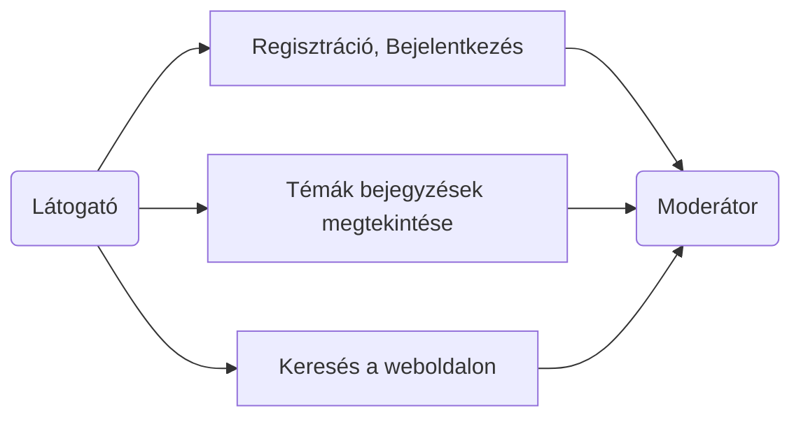

# Use case

```mermaid
graph LR

L(Látogató) --> RB[Regisztráció, Bejelentkezés]
L --> TM[Témák bejegyzések megtekintése]
L --> K[Keresés a weboldalon]
RB --> M(Moderátor)
TM --> M(Moderátor)
K --> M(Moderátor)

```