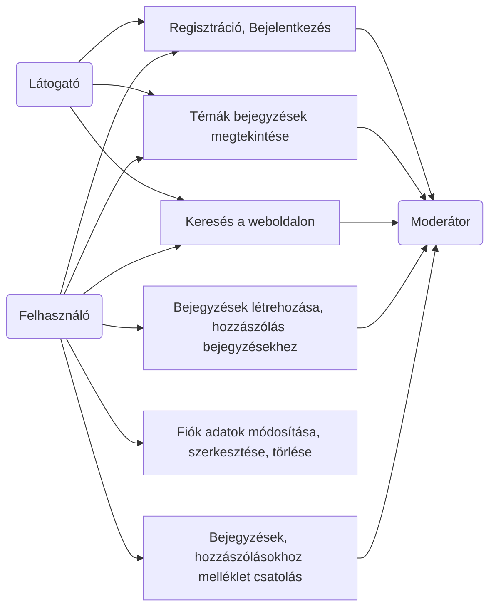

# Use case

```mermaid
graph LR

L(Látogató) --> RB[Regisztráció, Bejelentkezés]
L --> TM[Témák bejegyzések megtekintése]
L --> K[Keresés a weboldalon]
RB --> M(Moderátor)
TM --> M(Moderátor)
K --> M(Moderátor)

D(Felhasználó) --> RB
D --> K
D --> TM
D --> BL[Bejegyzések létrehozása, hozzászólás bejegyzésekhez]
D --> FK[Fiók adatok módosítása, szerkesztése, törlése]
D --> BA[Bejegyzések, hozzászólásokhoz melléklet csatolás]
BL --> M
BA --> M

```