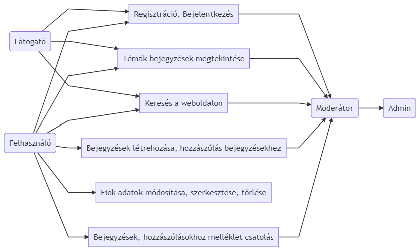

## **A rendszer célja és nem célja**

A weblapunk célja hogy egy közösséget formáljon a fórum használata által. A fórumra regisztrálók bejelentkezés után bejegyzéseket tudnak létrehozni, hozzászólni. Fontos, hogy a felhasználó könnyen el tudjon igazodni a felületeken ezért minimalista felhasználói felületet kap a weboldal. A moderátor szerepkörrel rendelkező felhasználók tudják szűrni a nem megfelelően viselkedő felhasználókat. A fórummal szeretnénk megtalálni azokat a személyeket akik erre vevők. A weboldal használható Androidos eszközökön, IOS eszközökön, illetve webes felületeken. A rendszer az adatokat egy adatbázisban tárolja.
A weblapunknak nem célja hogy fizetős legyen.

# Projekt terv

#### **Projektszerepkörök, felelőségek:**

- Projekt vezetők: Vajda Krisztián, Balogh Dániel, Mohai Ferenc
- Projekt kivitelezők: Zsadányi Rózsa, Németi Nikoletta, Kurán Bertalan
#### **Projektmunkások és felelőségek:**
- Projekt vezetők: A kivitelezők munkáját segitik, felügyelik projekt elemekhez példákat, ötleteket nyújtanak hogy a projekt sikeresen elkészüljön.
- Projekt kivitelezők: Feladatuk a projekt megtervezése, kivitelezése. (Frontend és backend elkészitése.)

## **Üzleti folyamatok modellje**

### Üzleti Szereplők

Akik használják a fórumot.

## **Üzleti folyamat**
1.Emberek regisztráljanak a fórumra.
2.Bejegyzéseket hozzanak létre.
3.Mások bejegyzéseit olvassák és szóljanak hozzá.
4.Segítsenek másokon.
5.Segítséget kérjenek másoktól.
6.Információkat osszanak meg egymással.
## **Követelmények**

### **Funkcionális követelmények:**
  - Könnyű kezelhetősége legyen
	- Áttekinhető és felhasználó barát felület
	- Optimalizálás különböző eszközökre
	- Optimalizálás különböző telefonos készülékekre

## **Funkcionális terv**

### Rendszerszereplők:
- Vendég
- Felhasználó
- Moderátor
- Admin

### Rendszerhasználati esetek és lefutásaik:
- **Vendég**:
	- Témák megtekintése
	- Bejegyzések megtekintése

- **Felhasználó**:
	- Regisztráció az oldalra
	- Saját adatainak módositása
	- Profil törlése
	- Témák megtekintése
	- Bejegyzések megtekintése
	- Bejegyzések létrehozása
	- Hozzászólás bejegyzésekhez
	- Kijelentkezés
	
- **Moderátor**:
	- Felhasználó által létrehozott bejegyzések,hozzászólások ellenőrzése
	- Bejegyzések ellenőrzése jóváhagyása

- **Admin**:
	- Szerepkörök kiosztása, változtatása
	- Témák létrehozzása
	
- **Menü-hierarchiák**:
	- Bejelentkezés
	- Regisztráció
	- Főoldal
	- Témák
	- Bejegyzések
	
- **Bejelentkezés után**:
	- Profil megtekintése
	- Bejegyzés létrehozzás
	- Hozzászólás bejegyzésekhez
	- Feliratkozás
	- Feliratkozások megtekintése
	- Kijelentkezés

## **Karbantartási terv**
A fórum a jövőben nem igényel nagy karbantartásokat, a szükséges karbantartások az 
alábbi egységekből állnak:

1. Frissebb verziójú app store történő tesztelés, hiba esetén azoknak javítása.
2. A kiszolgáló szerver státuszának ellenőrzése, offline szerver esetén újraindítás.
3. Igény esetén új funkciók implementálása.  
## **Fizikai környezet**

A mi elképzelésünk elképzelésünk szerint, python nyelven fogunk fejleszteni.

## **Telepítési terv**

### **Szoftver telepítési terv:**

A fórum használatához a GIT Repo-ra van csak szükség.

### **Tesztterv:**

A tesztelések célja a fórum funkcionalitásának teljes vizsgálata és ellenőrzése.
Tesztelési eljárások:

Unit teszt:

		Ahol csak lehetséges, szükséges már a fejlesztési idő alatt is tesztelni, hogy a metódusok megfelelően működnek-e
		
Alfa teszt:

		A teszt elsődleges célja az eddig meglévő funkcióknak a különböző eszközökkel való kompatibilitásának tesztelése. 
		A tesztet a fejlesztők végzik.
		Az eljárás sikeres, ha különböző eszközökben is megfelelően működnek a különböző funkciók. 
		A teszt időtartama egy hét.
		
Beta teszt:

		Ezt a tesztet nem a fejlesztők végzik.
		
		Tesztelendő kijelzőméretek: 1280x720 (minimum), 1366x768 vagy 1920x1080

		A teszt időtartama egy hét. 
		A tesztelés alatt a tesztelő felhasználók visszajelzéseket küldhetnek a fejlesztőknek, probléma/hiba felmerülése esetén.
		Ha hiba lép fel, a fejlesztők kijavítják a lehető leghamarabb. Sok hiba esetén a tesztelés ideje elhúzód

## **Projekt terv**

Project dolgozók: Kurán Tiger Bertalan, Balogh Dániel, Zsadányi Rózsa, Vajda Krisztián, Németi Nikoletta.

		Tervezet: Követelmény Specifikáció, Funkcionális Specifikáció, Rendszer Dizájn, Adattárolás, Tesztek.
		BackEnd: A back-end réteg feladata a front-end réteg felől érkező adatok feldolgozása, illetve a keletkezett eredmény a front-end számára történő visszajuttatása.
		FrontEnd: A front-end réteg feladata, a rendszerből kijutó adatok prezentálása, illetve a bejövő adatok fogadása a felhasználó vagy a csatlakoztatott rendszer felől.
